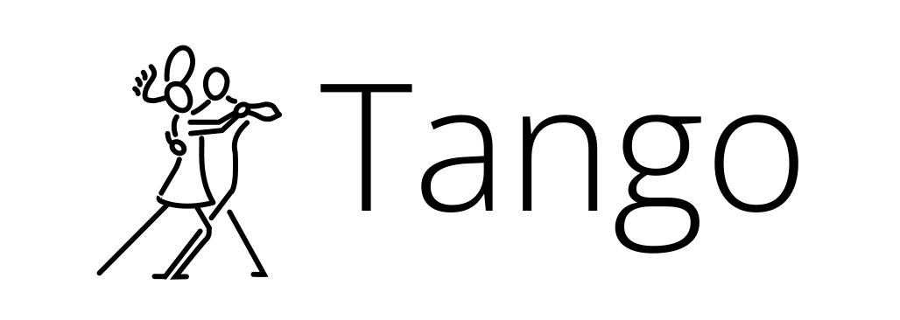

<p align="center"></p>
<p align="center"><i>"It takes two (processes) to Tango"</i></p>

Tango lets you write Gymnasium-style **Reinforcement Learning** code...

```python
import gymnasium as gym
import tango_bindings
from stable_baselines3 import PPO
from stable_baselines3.common.vec_env import DummyVecEnv

env = DummyVecEnv([lambda: gym.make("tango_bindings/ZeroMQ-v0")])

model = PPO("MlpPolicy", env, verbose=1)
model.learn(total_timesteps=100_000)

obs = env.reset()
for i in range(1000):
    action, _ = model.predict(obs)
    obs, reward, done, info = env.step(action)
env.close()
```

...for _live training_ and _fast deployment_ to **External Environments** (such as game engines, programmable robotics or IoT hardware, web crawlers, stock market intefaces, and more!)


<p align="center"></p>

_The Sokoban example is based on the [Phaser tutorial](https://phaser.io/news/2018/02/phaser-3-sokoban-tutorial) originally by [Emanuele Feronato](https://www.emanueleferonato.com/2018/02/09/phaser-3-version-of-the-html5-swipe-controlled-sokoban-game/)_

## 1. Introduction

### _1.a Motivation_

The Gymnasium `Env` class is a convenient interface for Reinforcement Learning code across the Open Source community, receiving support from multiple standardized RL organizations ([The Farama Foundation](https://farama.org/), [OpenAI's Gym Project](https://github.com/openai/gym), [Stable Baselines](https://stable-baselines3.readthedocs.io/en/master/), etc.)

However, the `Env` has an implicit design decision that can limit its scope: Since new environments are meant to inherit the `Env` base class, new environment observational and action spaces for RL agents are simplest to design as _callable python functions_. There are several cases where this can be problematic:

* Environments that cannot easily be wrapped and called as a function (eg: a pre-existing video game engine)
* Environments that cannot be paused or stepped through (eg: the live stock market, an active drone, etc.)
* Environments that uses closed-source software (eg: a programmable IoT device)
* Environments that are massively distributed and not under any one organization's control (eg: an agent operating on the internet)
* Environments using non-python code that would not easily be wrapped by Cython (eg: Go, Java)

Currently, for external environments, this is typically accomplished by structuring a Shimmy interface. However, this generally requires that the code be open source and be wrappable into python functions, which would be difficult-to-impossible under many of the cases discussed above. This significantly increases the barrier-to-entry for numerous fields where Reinforcement Learning would otherwise be an ideal solution.

### _1.b Proposed Solution_

Rather than force code to be embedded within the `Env` class, we can separate our RL code from the environment code and use message-passing to keep both sets of code synchronized. Doing so frees RL algorithms and environments from existing in the same source code file, or even the same computer.

_Unlike Shimmy (a dance for one) which embeds environment code, Tango (a dance for two) allows separated RL code and environment code to run in an independent yet closely synchronized fashion._

Message passing is ideally handled by a special `Env` class that spoofs the behavior of a standard `Env` class by communicating with the environment in an RPC-like fashion. Doing so has the benefit of allowing most RL algorithms designed for use with `Env` classes to work seamlessly with external environments. For example, this would allow Stable Baselines RL algorithms to be used with a video game, a drone, the stock market, etc. without the need to modify the algorithms or replicate the behavior of real-world environments. The example code does exactly this by training a PPO agent on a toy HTML5 game.

This proposed solution does put the onus of exposing an RPC-like interface within the environment so that the standard interface for `Env` classes can be implemented (eg: `reset()`, `step()`, `close()`, etc.) by the Tango `Env` class.

### _1.c Drawbacks_

While the proposed approach frees RL code to interact with external environments it does pose some limitations:

* Not all external environments can be "sped up" to accelerate training (eg: a real-world bipedal robot), so training may be slow
* Not all external environments are parallelizable
* Not all external environments can be "reset" (eg: the stock market)
* Not all external environments can be paused to be "stepped through"
* Increased complexity overhead

All that being said, Tango dramatically increases the number of systems that RL algorithms can be applied to, and leaves more opportunities to deploy pre-existing RL algorithms in live learning settings.

## 2. Design

### _2.a Overview_

Technical specifications for the above design approach will be given in this section. There are three main components to any project attempting to use Tango, with only the third needing to be created by the end-user:

1. The Tango `Env` Class
2. The Tango Gateway Server
3. The External Environment Env-like Interface


### _2.b Code Structure_

#### _2.b.1 Tango `Env`_

Much like any RL project using Gymnasium software, the user will create an environment with an `Env`-inheriting class. However, unlike a traditional RL project, when using Tango one will always use one of Tango's special `Env` classes. These classes wrap the connection to the Tango Gateway Server and helps convert `Env` function calls to JSON messages that will ultimately pass to the External Environment.

The first implemented connection type to the gateway server is a ZeroMQ connection, which is a tried-and-true messaging protocol known for its speed, lightweightedness, and being interoperable with multiple different programming languages, including Python. To specify a specific connection type, during the creation of the Tango `Env` class make sure to specify the protocol. Below is an example invoking a ZeroMQ protocol for communication with the Tango Gateway Server:

```python
import gymnasium as gym
import tango_bindings

gym.make("tango_bindings/ZeroMQ-v0")
```

The different interfaces and binding classes are all managed by the Tango project and users only need specify their preferred communication protocol.

#### _2.b.2 Tango Gateway Server_

The Tango Gateway Server principally converts JSON messages between different communication protocols (eg: WebSockets and ZeroMQ messages). In this version of the code it leverages a [Sanic web server]() to manage WebSocket connections, with a separate process to manage ZeroMQ connections using the same Asyncio loop.

Many different game engines support WebSockets, as do websites with JavaScript support, making it a convenient choice for External Environment connections to the Tango Gateway Server. A full list of game engines with WebSocket support is listed below:

* Phaser3 (HTML5) - Standard JS websockets
* Godot (GDScript) [https://docs.godotengine.org/en/stable/tutorials/networking/websocket.html]
* Unity - WebGL [https://github.com/endel/NativeWebSocket]
* PyGame - Websockets libraries (though PyGame doesn't need Tango)

For this initial example version for the RFC, only a WebSocket interface is included for External Environments. However, in the future additional common messaging protocols such as TCP and HTTP will be included to further increase the variety of environments that can communicate with the gateway server.

Users needn't change any code to use an instance of the server.

#### _2.b.3 External Environment Env-like Interface_

Unlike the Tango `Env` classes and the Tango Gateway Server, it is the responsibility of the user to connect their environment to the Tango Gateway Server and expose the following `Env`-like functions: 

1. `reset() -> observation, info`
2. `step(action) -> observation, reward, terminated, truncated, info`
3. `render() -> info` _\<optional\>_
4. `close() -> info`
5. `init() -> info`

The above arguments and returns are typed as follows:

* `observation` - An observation from a Gymnasium observation space
* `action` - An action from a Gymnasium action space
* `reward` - A `float` value indicating the reward for the given action
* `terminated` - A `boolean` value that is true when a terminal state is reached
* `truncated` - A `boolean` value that is true when the episode ends before a terminal state

Since these functions will read and manipulate the External Environment directly, the External Environment will need to catch incoming RPC message requests from the Tango Gateway Server and implement them on the External Environment. The `render()` function is optional, as a visualization may already exist for the External Environment.

For this POC hard-coded observation and action space have been implemented. But, by version `1.0.0` of the project, definitions for the observation space and action space will be definable from the External Environment via the `init()` function, which is called when an External Environment first connects to the Tango Gateway Server.

### _2.c Routing_

Both the ML code and the External Environment can connect to the Tango Gateway Server and communicate even if they attach using different interfaces (eg: WebSockets, TCP, HTTP, ZeroMQ, etc.)

Messages pass in an RPC-like manner from the ML code to the External Environment and back via the Tango Gateway Server in the following manner:

<p align="center"></p>

All messages in the current version are in JSON.

## 3. Next Steps

### _3.a In-Scope Additions_

Future code additions may include (but are not limited to) the following quality-of-life and Reinforcement Learning oriented upgrades:

* Speed benchmarks & comparison to running a straight Gymnasium `Env`
* PettingZoo support
* Multi-environment suport via Stable Baselines VecEnv
* Code quality updates (formatting / linting / test cases, and adherence to [Farama standards](https://farama.org/project_standards))
* Action and Observation spaces fully defined from the External Environment
* New example using a more appropriate game (eg: Arkanoid instead of Sokoban)
* Training examples using Phaser's "headless" mode w/ an accelerated frame rate
* Examples with additional game engines (Godot, Unity, etc.)
* Examples with non-game environments
* Examples of non-Stable Baselines RL code (eg: AlphaZero implementations)
* More interfaces for AI code (eg: TCP, HTTP, gRPC, WebSockets)
* More interfaces for external code (eg: TCP, HTTP, gRPC, ZeroMQ)
* Better management of errors and incorrect message passig 

Note that these are upgrades that would likely be considered "in-scope" for the Farama Foundation, and focus on Reinforcement Learning projects.

### _3.b Out-Of-Scope Additions_

The Tango Gateway Server approach may also be useful for other types of closely related projects that aren't strictly Reinforcement Learning based:

* LLM agent support
* LLM agent example via replication of "Generative Agents: Interactive Simulacra of Human Behavior" [(_Park et al. 2023_)](https://arxiv.org/abs/2304.03442)

## 4. Example Code

### _4.a Running_

To run the sample code, follow the steps listed below. Note that this is _early alpha code_, and is highly likely to contain many hiccups and undiscovered bugs! Please report any that you may encounter.

1. Install the Conda environments for the test game server and for Tango
```
conda env create -f ./examples/phaser/environment.yml
conda env create -f ./environment.yml
```
2. Open a new terminal, activate the game environment, and run the ***sample game server***
```
conda activate phaser
python ./examples/phaser/sokoban/game_server.py
```
3. Open a new terminal, activate the Tango environment, and run the ***Tango Gateway Server***
```
conda activate tango
python -m sanic tango_gateway.app --host=localhost --port=8000 --workers=1
```
4. Open your browser to `http://localhost:5000` to start an instance of the sample Sokoban game. This step must occur after steps #2 and #3
5. Open a new terminal, activate the Tango environment, and start the Stable Baeslines test example (or your own ***ML code***)
```
conda activate tango
python ./examples/phaser/sokoban/stable_baselines_test.py
```

If you go back to your browser where you opened an instance of the game, you should see it solving the Sokoban puzzle in an endless loop.

### _4.b Training_

If you also have an interest in training a model from scratch, then follow steps 1-4 above, and then proceed as follows:

5. Open a new terminal, activate the Tango environment, and start the Stable Baeslines train+test example
```
conda activate tango
python stable_baselines_train_test.py
```

If you go back to the browser window with the game instance, you will now see the ML model training directly on the instance itself.